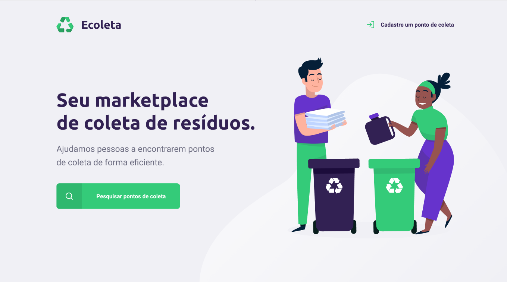

# Next Level Week #01


## O que é ?
Next Level Week é uma semana dedicada a levar os devs para o próximo nível na carreia profissional, utilizando as melhores e atuais tecnologias do mercado, direto ao ponto e do jeito certo. É um evento online e 100% gratuito criada pela empresa  [Rocketseat](https://rocketseat.com.br/).

## Objetivos
Aprender como são utilizadas, no mercado, as tecnologias para o desenvolvimento web e mobile, tudo integrado com um servidor, ou seja, através de um projeto realístico, criar o backend, frontend e mobile da aplicação.

O tema do projeto foi descarte correto de materiais orgânicos e inorgânicos. Como desde do dia 01/06/2020 teve início a semana internacional do Meio Ambiente, o projeto tem a sua temática voltada para esta área. O projeto, intitulado de **_Ecoleta_**, serve como uma conexão entre empresas ou entidades que coletam resíduos orgânicos e inorgânicos às pessoas que precisam descartar tais resíduos.

### Layout da aplicação:
[Ecoleta - Layout](https://www.figma.com/file/1SxgOMojOB2zYT0Mdk28lB/?viewer=1&node-id=)

## Algumas Tecnologias
* [TypeScript](https://www.typescriptlang.org/)
* [Node.js](https://nodejs.org/en/)
* [React](https://pt-br.reactjs.org/)
* [React-native](https://reactnative.dev/)

## Como usar
1. Clonar o projeto, backend, frontend e mobile.
2. Instalar as dependências do projeto. `npm install` ou `yarn install`
3. Dentro da pasta do backend, subir o servidor do projeto, por meio de um terminal e digitar o comando:
```
npm run dev
```
4. Feito isso, acessar a pasta do frontend, por meio de um terminal e digitar o comando:
```
npm start
```
Uma janela ou aba no navegador web deverá se abrir.

5. Caso queira rodar a aplicação mobile, acessar a pasta mobile, pelo terminal, e escrever o comando:
```
npm start
```
Uma janela ou aba no navegador web deverá se abir. Em seguida copie o QRCode no celular ou abrir um emulador Android ou IOS para acessar a aplicação.

**_OBS.: Troque o ip dos códigos para o ip da sua máquina._**

## Conclusão
O Ecoleta não é apenas um projeto de programação que visa ensinar node.js, react, react-native, etc. Mas também, trata-se de uma aplicação com viés realista e comunitário.

## Melhorias
Implementar o API do [IBGE-estados](https://servicodados.ibge.gov.br/api/docs/localidades?versao=1#api-UFs-estadosGet) e [IBGE-municípios](https://servicodados.ibge.gov.br/api/docs/localidades?versao=1#api-Municipios-estadosUFMunicipiosGet) no mobile para que os usuários apenas selecionem o estado e a cidade.

## Licença
Esse repositório está licenciado pela **MIT LICENSE**. 
